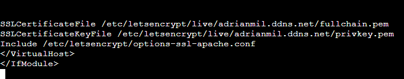

# Certificado let's Encrypt y acceder a la web https
## 1. Realizar la instalación y actualización de snapd

Primero se instala el paquete haciendo: **snap install core**

Luego para actualizar se hace: **snap refresh core**

## 2.  Eliminar si existiese alguna instalación previa de certbot con apt

Para eliminar alguna instalación previo hay que hacer el siguiente comando: **apt remove certbot -y**

Esto eliminará el paquete de certbot

## 3. Instalar el cliente de Certbot con snapd.

En este paso se instalará el cliente de Certbot para poder tener nuestro certificado

Se utiliza este comando: **snap install --classic certbot**

## 4. Crear un alias para el comando certbot

Este paso lo que hará es un enlace simbolico dentro de la ruta **/usr/bin/** para que este se pueda utilizar como comando

el comando es el siguiente: **ln -fs /snap/bin/certbot /usr/bin/certbot**

## 5. Crear o modificar la pagina web http con tu nombre de dominio

Este paso es necesario que en la ruta **/etc/apache2/sites-available** del servidor web haya un archivo .conf el cual solo sea http y le añadas el dominio creado en la pagina de NoIP

en mi caso seria asi:

Mi .conf se llama empresa

dentro de empresa hay que poner tu dominio, la ruta al documento el cual accederá y en mi caso un directorio el cual solo será accesible con usuario y contraseña hechos con digest

Para esto tambien hay que tener en la ruta /var/www/ el directorio que vamos a utilizar y dentro de el un index.html 

## 6. Obtener el certificado y configurar el servidor web Apache.

Una vez hecho lo anterior este paso creará el certificado pero primero hay que habilitar el sitio creado haciendo: **a2ensite empresa.conf**

en la ruta /etc/apache2/sites-enabled aparecerá la web habilitada

a partir de aqui ya se puede ejecutar el comando **certbot --apache**

esto preguntará primero sobre el dominio al cual le hará el certificado, en mi caso es **adrianmil.ddns.net**

Luego preguntará sobre:
 - email
 - aceptar el registro con el servidor ACME
 - spam sobre una organizacion pero la rechazamos

con eso el certificado ya estaría hecho y a parte crea el .conf con https y lo habilita por lo que ahorra el tiempo de creacion de otro .conf 

el contenido:

## 7. Acceder a la web

Con esto solo falta acceder a la web a traves del navegador por lo que solo haria falta poner **https://adrianmil.ddns.net** 

si esto no funciona hay que tocar el fichero de hosts para que pueda resolver el nombre

Si quiero acceder a **https://adrianmil.ddns.net/admin** debo colocar un usuario y contraseña

Al introducirlo aparecerá el index de admin

