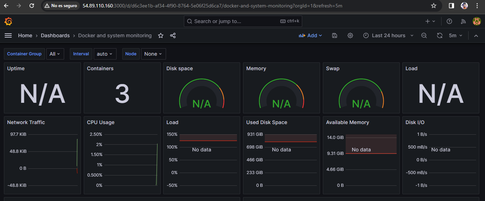

## Monitorización de un servidor

Primero, crear una red de docker:

docker network create monitoring-net

### Contenedor Prometheus

Descargar la imagen de prometheus

docker pull prom/prometheus:latest

Crear el directorio /prometheus-data que contendrá el fichero de configuración prometheus.yml

y ahora arrancar el contenedor de la siguiente forma:

docker run -d --name=prometheus --network=monitoring-net -p 9090:9090 -v=/prometheus-data:/prometheus-data prom/prometheus:latest --config.file=/prometheus-data/prometheus.yml

Entrar por la siguiente URL:

http://ip-instancia:9090

### Contenedor cAdvisor

Descargar la imagen de cadvisor:

docker pull gcr.io/cadvisor/cadvisor:latest

y  arrancar el contenedor:

docker run --name=cadvisor --network=monitoring-net --volume=/:/rootfs:ro --volume=/var/run:/var/run:rw --volume=/sys:/sys:ro --volume=/var/lib/docker/:/var/lib/docker:ro --publish=8080:8080 --detach=true gcr.io/cadvisor/cadvisor:latest

Entrar por la siguiente URL:

http://ip-instancia:8080

### Contenedor Node Exporter

Arrancar el contenedor:

docker run -d --name=node-exporter --network=monitoring-net -p 9100:9100 prom/node-exporter:latest

Se puede entrar por la siguiente URL:

http://ip-instancia:9100

### Contenedor Grafana

Arrancar el contenedor:

docker run -d --name=grafana -p 3000:3000 --network=monitoring-net grafana/grafana:latest

Entrar por la siguiente URL:

http://ip-instancia:3000

Hay que entrar con el usuario admin y contraseña admin, Luego se puede modificar la contraseña por la que quieras.

Luego hay que entrar en data source y darle a Prometheus y configurarlo

Solo falta importar los dashboard con los ID 1860 y 893

Dashboard 1860:

Dashboard 893:

Desde estos dashboards se pueden monitorear los contenedores de Docker