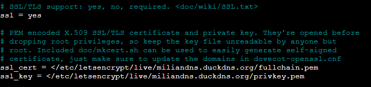

## Servidor de Correo Electrónico

### MTA. Postfix con los protocolos SMTP y STARTTLS.

Primero instalar el paquete de Postfix, el cual hay que asignarle un sitio de internet.

Asignas un nombre al sistema de correo, en mi caso es miliandns.duckdns.org.

Ahora ya se puede configurar el archivo main.cf en la ruta de postfix.

el archivo debe quedar de esta forma:

Para obtener el certificado y clave privada he usado el certbot haciendoselo a miliandns.duckdns.org

Desde master.cf he abierto el puerto de submission

### MDA. Dovecot con los protocolos IMAP, IMAPs y opcionalmente POP3 y POP3s

Instalar los paquetes siguientes:

- dovecot-pop3d
- dovecot-imapd

Ahora ya se pueden tocar los ficheros de dovecot, son varios archivos por lo que mostraré lo modificado en cada uno:

10-auth.conf:

10-mail.conf:

10-master.conf:

10-ssl.conf:

Ya solo falta el cliente de Thunderbird

Entras con:

usuario@dominio

y la contraseña del usuario

Despues de esto solo falta configurar

el servidor 

y tambien el servidor SMTP

Con esto ya se puede probar a enviar un correo a ti mismo

Creando un nuevo mensaje pones a quien se lo envias y un mensaje cualquiera

y como prueba de que ha funcionado se mostrará en la bandeja de entrada

Con esto el servidor de correo ya está funcional