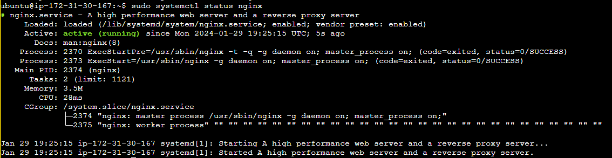
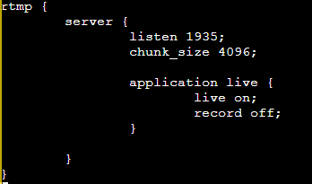
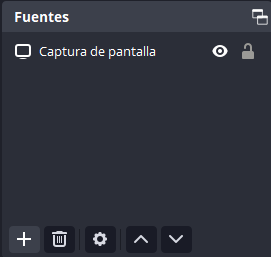
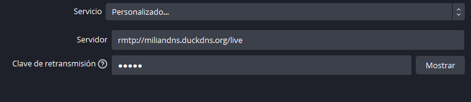
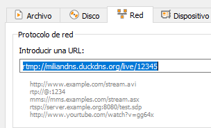
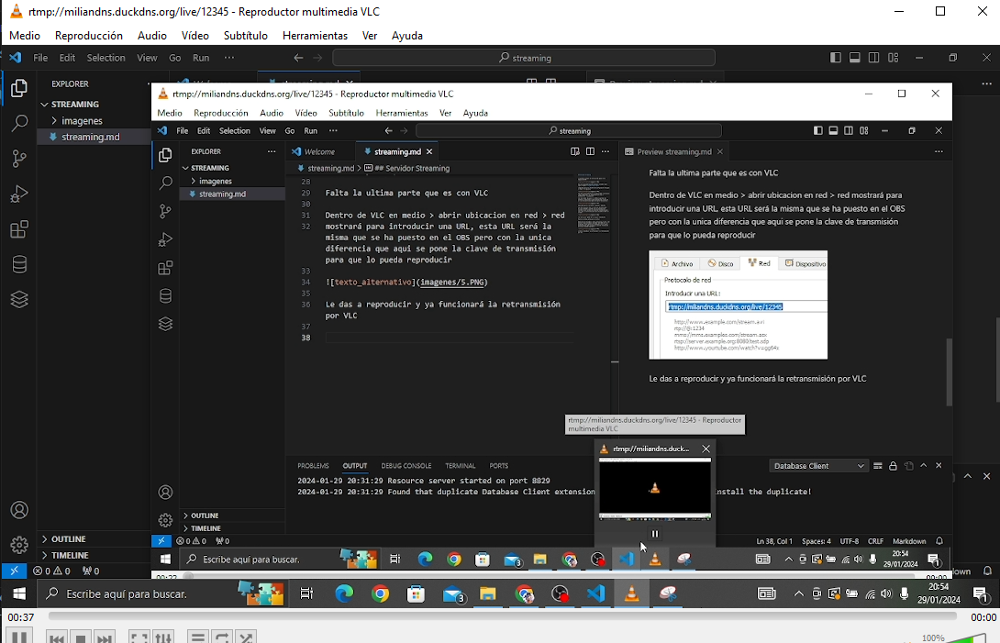

## Servidor Streaming

Lo primero instalar el servicio de nginx en la maquina de AWS

Una vez instalado hay que instalar un modulo para nginx llamado **libnginx-mod-rtmp**

Luego hay que ir al fichero de configuración de nginx y añadir lo siguiente:

Con esto se escuchara por el puerto 1935 al protocolo rtmp y habilitará la transmision en vivo y deshabilitará la grabación

Con esto hecho hay que ir al OBS al apartado de fuentes y seleccionar lo que quieres que se vea, en mi caso he puesto que haga una captura de pantalla

Ahora hay que ir a archivo > ajustes > emisión

Con esto hay que crear un servicio personalizado
el cual contendrá una URL con la ruta hacia el servidor y por ultimo una clave de transmision que será como la contraseña para que se pueda acceder al stream

Con esto ya se puede dar a iniciar transmisión

Falta la ultima parte que es con VLC

Dentro de VLC en medio > abrir ubicacion en red > red
mostrará para introducir una URL, esta URL será la misma que se ha puesto en el OBS pero con la unica diferencia que aqui se pone la clave de transmisión para que lo pueda reproducir

Le das a reproducir y ya funcionará la retransmisión por VLC

