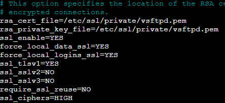

# Servicio de Hosting

## 1. Modo Pasivo

Para que el ftp actue de forma pasiva se necesita poner las siguientes lineas en el archivo de configuracion **vsftpd.conf**

Con estas lineas habilitas el modo pasivo y le indicas el rango de puertos por el que escuchará

## 2. FTPS Explicito

Para este paso hay que hacer un nuevo certificado con tus datos y agregar lo siguiente al archivo **vsftpd.conf**

Esto indica el certificado y clave, habilitar el SSL y forzar el acceso por SSL

## 3. Usuarios enjaulados en public_html

Este paso necesita dos linea las cuales permiten indicar al usuario el directorio por el que se podrá mover

Estas lineas indican que el usuario cuando conecte aparecerá en ese directorio

## 4. Funcionamiento

