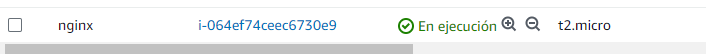
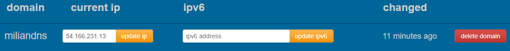
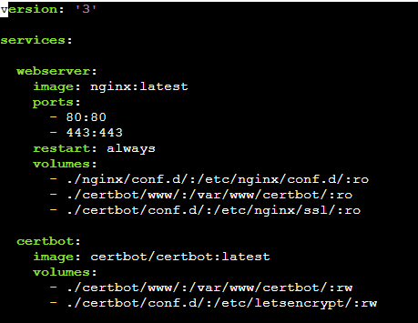
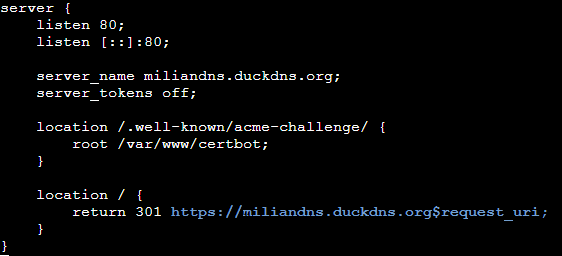
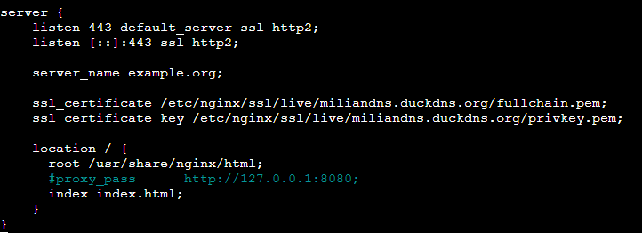
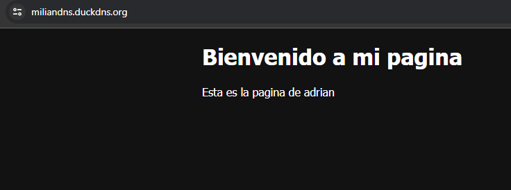
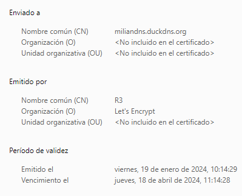

## WEB externa

## crear una nueva instancia en AWS y configurarla con un contenedor NGINX.

Lo primero es meterse en AWS y crear una nueva instancia de ubuntu server

Una vez hecha hay que designarle un nombre de dominio para esta instancia utilizando **duckdns**

Cuando creas el dominio hay que ir a la instancia y asignarle ese dominio con un simple paso hecho con **crontab**

comando:

*/5 * * * * curl "https://www.duckdns.org/update?domains=YOUR_DOMAIN&token=YOUR_TOKEN&ip=" >/dev/null 2>&1

Este comando es el ejemplo que hay que hacer solo tienes que poner tu dominio y el token que aparece en duckdns y con eso ya tienes asignado un dominio en la instancia

ahora que ya tenemos el dominio hay que crear un docker con nginx y otro con certbot, para esto uso un docker-compose.yml en la cual añadiré las dos imagenes y los volumenes los cuales se compartiran para mis configuraciones y html

muestra del compose:

En nginx abro los puertos 80 y 443, lo reinicio siempre y creo 3 volumenes los cuales el primero es para las configuraciones de nginx y el ultimo es una carpeta que van a tener en comun tanto el certbot como nginx

y el certbot solo tiene 2 volumenes, la carpeta compartida entre los dos contenedores que en este caso se usara para crear el certificado

para ello en cada una de las rutas se necesitan los ficheros que voy a mostrar.

configuración:

el archivo contiene el http 

para crear el certificador hay que poner el siguiente comando:

docker-compose run --rm  certbot certonly --webroot --webroot-path /var/www/certbot/ -d example.org

hay que cambiar example.org por el dominio que has puesto en el fichero de configuracion

Una vez hecho eso solo hace falta añadir dentro del fichero de configuracion lo siguiente:

Esto pondria la parte de https y indicar el certificado creado.

Una vez hecho ya solo falta comprobar que puedo acceder

Para crear tu propia pagina se puede crear un volumen dirigiendo a los html y poner tu pagina ahi

y el certificado:

