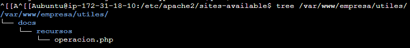
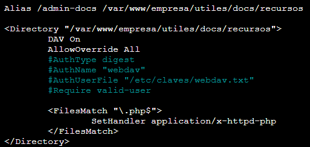
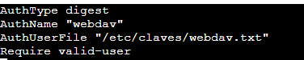
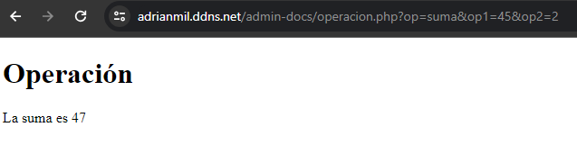

# WEB de la empresa. Funcionalidades premium

## 1. Vamos a añadir un nuevo directorio para que el administrador pueda colgar en la WEB los documentos o recursos que le apetezca. Para ello vamos a crear un directorio en /var/www/empresa/utiles/docs/recursos/

## 2. Para el administrador el modo de acceso para colgar sus registros será con el protocolo WebDAV y seguridad Digest. Además el administrador quiere poder modificar facilmente la configuración del directorio, por ello quiere que este en un archivo .htacess. La manera de acceder es con (alias) https://empresa.ddns.ne/admin-docs 

Para esto se necesita poner en el archivo.conf un alias hacia la ruta y dentro del directorio que se actuará poner que la directiva DAV y AllowOverride permitan todo sobre ese directorio y asi el .htaccess pueda funcionar

contenido del .htaccess:

## 3. Para acabar, el administrador quiere subir y utilizar archivos php como el adjunto. ofrecele está posibilidad (instala php). Probarlo https://empresa.ddns.ne/admin-docs/operacion.php?op=suma&op1=45&op2=2

Primero hay que instalar php, una vez instalado añades el archivo operacion.php en la ruta creada y se comprueba poniendo la ruta del ejemplo para comprobar que funcionan las operaciones matematicas del fichero php

